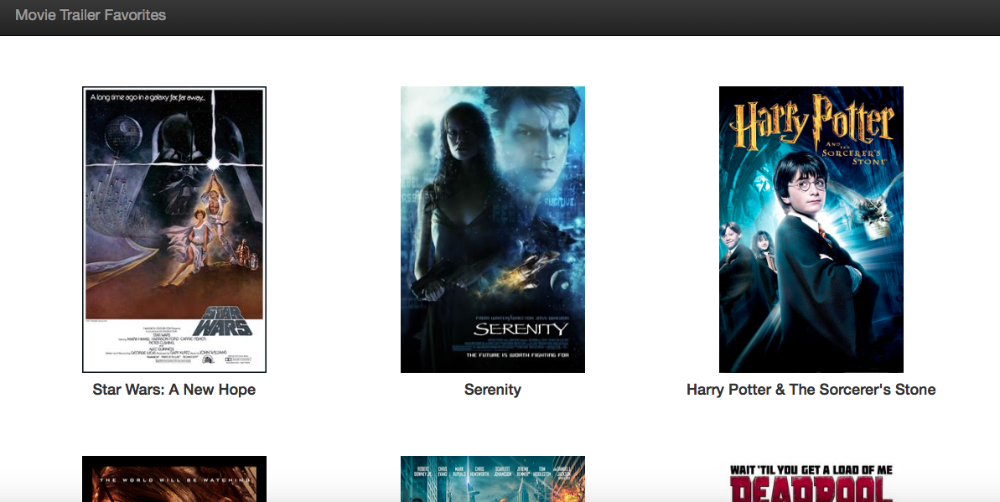

# ud036_StarterCode
This Python code loads a default web browser that displays several movies in which the user may click to watch the movie's trailer. Enjoy the trailers to some of my favorite movies!

##Requirements
This code is written in Python 2.7 & can be downloaded [here](https://www.python.org/downloads/)

##Steps to Download & Run Program
1. Using the green "Clone or download" button above, choose "Download ZIP" to download these files to your computer.
2. On your computer, unzip the downloaded file.
3. Using IDLE 2.7 (provided with the Python 2.7 installation), open the file "entertainment_center.py"
4. From the menu bar in IDLE, select Run > Run Module.
5. This should open your default web browser with a selection of my favorite movies.
6. Click on a movie to load & enjoy its trailer!

##Screenshot of Application

